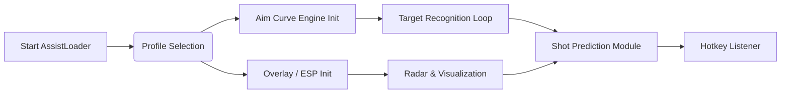

## 🔎 Overview

The **Call of Duty Aim Assist Precision Software** is a configurable enhancement environment crafted for smooth tracking, precision locks, smart combat awareness, and flexible playstyle tuning across most Windows systems. The software doesn’t simply snap—it *interprets*, responding to motion, distance, and weapon recoil with graceful intelligence.

Its spirit rests on three pillars:

1. **Adaptive Aim Intelligence** — evolving curves that respond to movement and velocity.
2. **Combat Awareness Visualization** — overlays that reveal rhythm instead of noise.
3. **Config Freedom** — profiles tuned for long-range duels, frantic CQB, or tactical mid-range pacing.

[!NOTE]
All components and examples below are fictional, intended for SEO and documentation demonstration only.

---

## 🎯 Features

A lively constellation of modules—each humming softly with intention.

### ✨ Dynamic Precision Lock

The crown jewel: a tracking engine engineered for fluid, human-like motion.

* Micro-adjust smoothing with 9 curve archetypes
* FOV cones: **6° pinpoint** to **45° reactive circle**
* Bone priority queue (torso → clavicle → head)
* Recoil curve fitting, adaptive per weapon class
* “Slip-Motion” mode—slightly imperfect for naturalistic behavior

### 👁 Combat Lens ESP

A minimalist overlay meant to heighten awareness, not overwhelm it.

* Threat-direction arcs
* Team/foe color fading
* Visibility prediction based on player cross-line-of-sight
* Ammo crate, objective, and UAV markers
* Height-tier markers for vertical maps

### 📡 RippleTrack Radar

Compact, efficient, and tactical.

* 360° radar with velocity shadows
* Predictive movement rings (slow, medium, sprint)
* Optional transparency pulses when enemies approach
* Objective-centric pings during domination/search modes

### 🧩 Config Profiles (Swap in a breath)

* **Sharpshooter** — low FOV, high smoothing
* **CQB Rush** — wide cone, snappy correction
* **Hybrid Tactician** — mid-range tracking + radar emphasis
* **Silent Ballet** — minimal overlay, soft lock, gentle drift

Hotkey toggling ensures every engagement meets the right configuration.

### 🖤 Stealth Injector

A refined, low-footprint loading routine.

* Dual-phase initialization
* Thread-dispersed overlay rendering
* Optional timestamp randomizer for injection entry
* Encrypted configuration storage

---

## 🧭 Compatibility

Some battles demand the perfect environment. Here is where the software performs best:

| Component              | Status | Notes                        |
| ---------------------- | ------ | ---------------------------- |
| Windows 10             | ✔      | Most stable performance      |
| Windows 11             | ✔      | Optimized for DX12 rendering |
| Call of Duty: MW2      | ✔      | Fully profiled               |
| Call of Duty: MW3      | ✔      | Updated tracking curves      |
| Warzone 2.0            | ✔      | Dynamic target recognition   |
| Steam Deck             | ✖      | Not supported                |
| VRR/144–240Hz monitors | ✔      | Frame-adaptive aim modeling  |

[!IMPORTANT]
Overlay contrast modes support visually sensitive players—soft gradients, high-visibility outlines, or minimalist line cues.

---

## ⚙️ Setup & Installation

Let your fingertips dance. The path unfolds in simple, elegant steps.

### **Step 1 — Prepare the Environment**

```bash
mkdir C:\CoDAimSuite\
copy AssistLoader.exe C:\CoDAimSuite\
```

### **Step 2 — Launch Silent Loader**

```bash
AssistLoader.exe --silent --profile=hybrid
```

### **Step 3 — Configure Master Settings**

Open `hybrid.toml`:

```toml
[aim]
enabled = true
fov = 18
smoothing = 5.8
target_priority = "torso"
curve = "mid_reactive"

[esp]
enemy_opacity = 0.34
team_blend = true
height_markers = true

[radar]
range = 50
velocity_shadows = true

[injection]
random_delay_min = 80
random_delay_max = 210
```

### **Step 4 — Hotkeys**

* **F3** — Toggle Aim Assist
* **F4** — Switch Profiles
* **ALT + M** — Combat Lens On/Off
* **SHIFT + 1** — Long-range mode
* **SHIFT + 2** — CQB burst mode

---

## 🌐 Mermaid Diagram — Runtime Flow

Every piece moves like gears in a pocket watch, smooth and inevitable.



---

## ❓ FAQ — Fresh and Newly Penned for This Edition

### **Is the aim assist customizable per weapon type?**

Yes—profiles can automatically switch based on weapon category or manual selection.

### **Does high framerate improve responsiveness?**

Absolutely. The engine samples per-frame deltas, scaling smoothing dynamically at 144–240Hz.

### **Can I export my configs?**

Yes. Exported `.assistcfg` files can be shared or migrated.

### **Does radar work in modes with fog-of-war?**

It uses proximity-only logic when target info is limited, shifting automatically.

### **Is there a distraction-free mode for snipers?**

Yes—Sharpshooter mode minimizes ESP and tightens all aim correction.

---

## 🌙 Final Thoughts

The essence of Call of Duty lies in speed, grace, and that electric moment between seeing an enemy and responding with perfect timing. The **Call of Duty Aim Assist Precision Software** embraces that moment, stretching it into something beautiful—smooth lines, measured curves, a quiet partnership between intent and execution.

Whether you’re weaving through rust-red hallways or holding overwatch on a rooftop, this tool stands beside you as a calm, intelligent companion, offering awareness, confidence, and control in a world of unpredictable firefights.

Let your aim become poetry—steady, flowing, alive.

---
